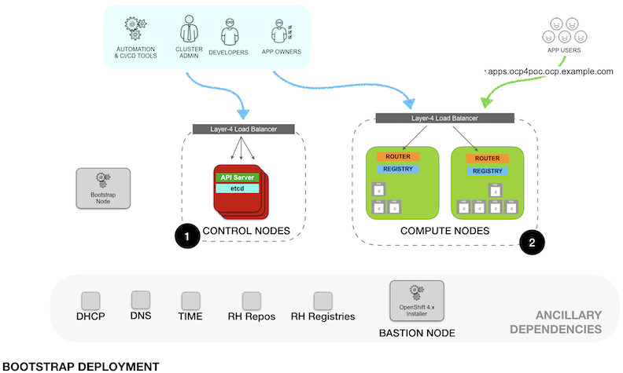
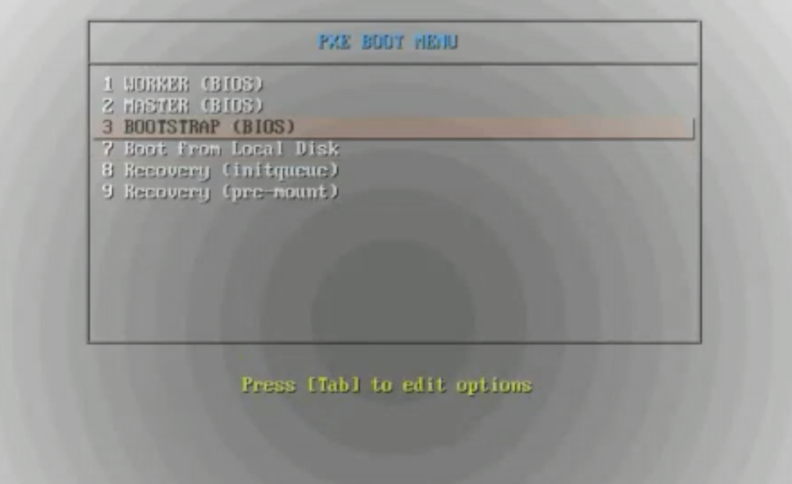
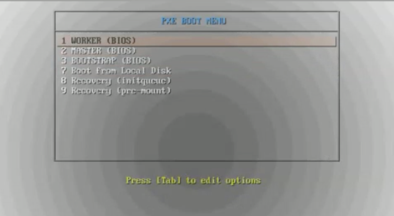

# OpenShift 4.1 UPI bare-metal (using PXE boot)

This is a reference documentation for POCs of OpenShift 4.1 UPI bare-metal deployment using PXE Boot.

The initial deployment is as per the following diagram 



***NOTE:*** Even when the diagram shows two different load balancers, the access for the operations and administration tasks as well as the applications traffic are documented to go over the same load balancer. For a production grade deployment, the control and operation ports (K8s API, Machine Server, etc.) should not be exposed outside the organization.

# TL;DR

1. Clone this repo to the Bastion Node
2. Edit the `install-config.yaml` to match your environment
3. Execute `poc.sh` script:
```
./poc.sh clean

./poc.sh ignition

./poc.sh custom

./poc.sh prep_ign
```
4. Power up the Bootstrap Node and PXE install the RHCOS
5. Power up the Master Nodes and PXE install the RHCOS
```
# Monitor bootstrap progress:
./poc.sh bootstrap
```
6. Once bootstrap complete, shutdown Bootstrap Node
7. Power up the Worker Nodes and PXE install 
```
# Monitor OCP install
./poc.sh install
```
8. Monitor CSR requests from the Worker Nodes and accept the certificates

NOTE: There are two CSR's per Node that need to be accepted.
```
$ export KUBECONFIG=./ocp4poc/auth/kubeconfig

$ ./oc get csr

$ ./oc adm certificate approve <crt-name>

```


# Reference Environment 

- Base Domain: example.com
- Cluster Name: ocp4poc

| NODE      | IP ADDRESS   |
|:----------|:-------------|
| bootstrap | 192.168.1.10 |
| master-0  | 192.168.1.11 |
| master-1  | 192.168.1.12 |
| master-2  | 192.168.1.13 |
| worker-0  | 192.168.1.15 |
| worker-1  | 192.168.1.16 |
| worker-2  | 192.168.1.17 |

***NOTE:*** For easy customization, clone this repo to your Bastion Node.

Modify the following environment variables of `./poc.sh` script to match your environment.
```
OCP_RELEASE=4.1.0
RHCOS_BUILD=4.1.0
WEBROOT=/opt/nginx/html/
TFTPROOT=/var/lib/tftpboot/
POCDIR=ocp4poc
```
***NOTE:*** Next instructions assume this has been customized. 

## Pre-requisites
### DNS Configuration 
- Example of [forward DNS records](utils/named-zone.conf) included in the `utils` folder
- Example of [reverse records](utils/named-reverse-zone.conf) included in the `utils` folder
- DNS must have entries for:
  - DNS forward records for all Nodes
  - DNS reverse records for all the Nodes
  - DNS entries for special records used by OCP: `etcd`, `etcd srv`, `api`, `api-int`, and `*.apps` wildcard subdomain

Reference official [documentation](https://docs.openshift.com/container-platform/4.1/installing/installing_bare_metal/installing-bare-metal.html#installation-dns-user-infra_installing-bare-metal) for details on special entries required in DNS.

***NOTE:*** If there is NO way to reach out to the external NTP and DNS servers from the masters and workers node then you can set proxy DNS . DNS/NTP query in this will flow like this . 
- master node > bastion node > external DNS/NTP server 
- worker node > bastion node > external DNS/NTP server 
 
 In this case no need to use bastion as recursive DNS, set port=0 in /etc/dnsmasq.conf file.

***NOTE:*** While setting up the external DNS server make sure the A records priorities for master and etcd are set properly . We want to have higher priority for master A records as compared to etcd A record . Otherwise what will happen is when we try to install master nodes ,during the reverse lookup step it might get the etcd FQDN instead of master FQDN!!  

***NOTE:*** If using Microsoft external DNS server you can use CNAME for etcd FQDN's

### Load Balancer Configuration
- Setup load balancerconfiguration in ***pass-through*** for Kubernetes API (`tcp/6443`), Machine Server Config (`tcp/22623`), OpenShift Routers HTTP and HTTPS (`tcp/80`, `tcp/443`)

Reference Load Balancer configurations available in the `utils` folder (use one of the two):
  - Load balancer using [HAProxy](utils/haproxy.cfg) at system level (installed from RPM)
  - Load balancer using HAProxy as [System Container](utils/poc-lb.service) managed by systemd

NOTE: If seeing port bind errors starting the load balancer check SELinux settings:
```
# List the permited ports
semanage port -l | grep http_port_t

# If need to add ports
semanage port -a -t http_port_t -p tcp 6443
semanage port -a -t http_port_t -p tcp 22623
semanage port -m -t http_port_t -p tcp 8000
```

#  > > > CAVEATS AND THINGS TO KNOW < < <

- WHEN USING A PHYSICAL SERVER WITH MULTIPLE NICs:
  - The `PXE APPEND` command **must specify** the exact NIC to use during the PXE boot. For example using `ip=eth2:dhcp` and NOT the generic dhcp entry `ip=dhcp`
  - If the `PXE APPEND` use the `ip=dhcp`, the DNS information from the *last* NIC to come up will be used as the entry for `/etc/resolv.conf`.
    - If the last NIC to come up has a self-assigned IP and does not receive a DNS, the `/etc/resolv.conf` will be empty. When this happens the Node will attempt to use the localhost `[::1]` as the DNS and the installation will fail. To work around this, during the installation:
      - Avoid having NICs with active link that are not receiving valid IPs
      - Pass the `nameserver=<nameserver_ip>` with the `PXE APPEND` command
  - If the server has *too many* NICs, the `NetworkManager-wait-online.service` may timeout before the DHCP timeout of each NIC card. When this happens, a cascaded failure may be triggered. To avoid this situation, there is a patch (see [utils/nm-patch.json](utils/nm-patch.json)) that should be appliend to the Ignition files to increase the timeout of this service and avoid the situation.

- Using the `PXE APPEND` to disable IPv6 using the `ipv6.disable` does not work. This flag is ignored at this time.
- When customizing Ignition files to write custom files or configurations in the Node, the permissions must be specified in ***OCTAL*** mode (i.e. 384), NOT in DECIMAL (i.e. 600).
- If there is no valid reverse DNS resolution during the installation, the Masters (and all the Nodes) will register as `localhost.localdomain` into the Kubernetes etcd. When this happens it will fail to identify the existence of multiple masters and the installation process will fail.

# Preparing the Bastion Node

- Install PXE Boot pre-requisites
    ```
    yum -y install https://dl.fedoraproject.org/pub/epel/epel-release-latest-7.noarch.rpm
    yum -y install tftp-server dnsmasq syslinux-tftpboot tree python36 jq oniguruma

    subscription-manager repos --enable rhel-7-server-extras-rpms
    yum -y install podman skopeo
    ```

- (optional) Setup HAProxy as load balancer
    - Update `./utils/haproxy.cfg` to match your environment
    ```
    mkdir -pv /opt/haproxy

    cp ./utils/haproxy.cfg /opt/haproxy
    cp ./utils/poc-lb.service /etc/systemd/system/poc-lb.service

    podman pull haproxy

    systemctl daemon-reload

    systemctl start poc-lb
    systemctl status poc-lb
    systemctl enable poc-lb
    ```

- Setup web server for Ignition and PXE files
    ```
    mkdir -pv /opt/nginx/html/metal

    cp ./utils/poc-pxe-http.service /etc/systemd/system/poc-pxe-http.service

    podman pull nginx

    systemctl daemon-reload
    
    systemctl start poc-pxe-http
    systemctl status poc-pxe-http
    systemctl enable poc-pxe-http
    ```

## Setting up DNSmasq for PXE Boot

1. (if already running Bind server in Bastion) Disable DNS in DNSmasq by setting `port=0`
    ```
    vi /etc/dnsmasq.conf
    ...
    port=0
    ...
    ```
2. Configure DHCP and DHCP PXE Options following the reference [dnsmasq-pxe.conf](utils/dnsmasq-pxe.conf)
    ```
    cp ./utils/dnsmasq-pxe.conf /etc/dnsmasq.d/dnsmasq-pxe.conf
    ```
NOTE: Update `/etc/dnsmasq.d/dnsmasq-pxe.conf` to match environment

## Setup PXE Boot Configurations

1. Create PXE Boot menu to be used by the environment [/var/lib/tftpboot/pxelinux.cfg/default](utils/pxelinux.cfg-default-bios)

```
mkdir -pv /var/lib/tftpboot/pxelinux.cfg/

copy ./utils/pxelinux.cfg-default-bios /var/lib/tftpboot/pxelinux.cfg/default
```
NOTE: Update `/var/lib/tftpboot/pxelinux.cfg/default` to match environment.


2. Download RHCOS images.

  - Running `./poc.sh get_images` download all the images to `./images` on your current directory. It should be similar to this list (versions may be different):
  
    ```
    images/
    ├── openshift-client-linux-4.1.4.tar.gz
    ├── openshift-install-linux-4.1.4.tar.gz
    ├── rhcos-4.1.0-x86_64-installer-initramfs.img
    ├── rhcos-4.1.0-x86_64-installer.iso
    ├── rhcos-4.1.0-x86_64-installer-kernel
    ├── rhcos-4.1.0-x86_64-metal-bios.raw.gz
    └── rhcos-4.1.0-x86_64-metal-uefi.raw.gz
    ```

3. Open the `openshift-client-linux-4.1.0.tar.gz` and the `openshift-install-linux-4.1.0.tar.gz` into your current directory. This will provide the `openshift-installer`, `oc` and `kubectl` binaries.
   
4. Copy RHCOS PXE images and RHCOS images into the corresponding folders
   
```
./poc.sh prep_images
```

5. Uncompress installer and client binaries into current directory

```
./poc.sh prep_installer
```

## Ports to open if Bastion node running all the ancillary services

```
firewall-cmd --zone=public   --change-interface=eth0
firewall-cmd --zone=internal --change-interface=eth1

firewall-cmd --get-active-zones

firewall-cmd --zone=public   --permanent --add-port=6443/tcp 
firewall-cmd --zone=public   --permanent --add-port=22623/tcp 
firewall-cmd --zone=public   --permanent --add-service=http
firewall-cmd --zone=public   --permanent --add-service=https
firewall-cmd --zone=public   --permanent --add-service=dns

firewall-cmd --zone=internal --permanent --add-port=6443/tcp
firewall-cmd --zone=internal --permanent --add-port=22623/tcp
firewall-cmd --zone=internal --permanent --add-service=http
firewall-cmd --zone=internal --permanent --add-service=https
firewall-cmd --zone=internal --permanent --add-port=69/udp
firewall-cmd --zone=internal --permanent --add-port=8000/tcp
firewall-cmd --zone=internal --permanent --add-service=dns
firewall-cmd --zone=internal --permanent --add-service=dhcp

firewall-cmd --reload

firewall-cmd --zone=internal  --list-services
firewall-cmd --zone=internal  --list-ports

```

# INSTALLATION

- Create or edit `install-config.yaml` to include the pull secret obtained from [https://try.openshift.com](https://try.openshift.com)

- Add the SSH Key to be used to access the Bootstrap Node to the `install-config.yaml`

- Generate the Ignition files:

    `./poc.sh ignition`

- Apply custom patch for NetworkManager:

    `./poc.sh custom`

- Copy Ignition files into web server path
  
    `./poc.sh prep_ign`

- Boot the Bootstrap Node and at the PXE MENU select the `BOOTSTRAP` option and press `Enter`
  
  - This will start the process of installing RHCOS in the Bootstrap Node 

    

- Wait until the bootstrap Node is up and showing the login prompt

(missing image here)

- Monitor bootstrap progress using the script or the equivalent `openshift-install wait-for ...` command

    `./poc.sh bootstrap`

- Start the Master Nodes and select the `MASTER` option from the PXE menu

    

- The boot process of the Masters will start the RHCOS installation and use the Ignition configuration during the first install.
  - After RHCOS is installed in the Node, it will be up for a few minutes showing the login prompt and eventually will reboot. This is a normal part of the automatic upgrade process of RHCOS.
    - The Master node receives the actual configuration as a rendered Machine Config from the Bootstrap Nodes.
    - During the process, the Cluster Version Operator instruct the Master Nodes to start deploying the components corresponding to the Master Node.
    - One of the actions is the upgrade of RHCOS so the Node will download latest RHCOS version and will apply it.
    - After upgrading the OS, the Nodes reboot into the latest version of RHCOS
    - During the process, the Cluster Version Operator instruct the Master Nodes to start deploying the components corresponding to the Master Node.

- Once the Bootstrap Node reports the bootstrap process as completed and indicates it is safe to shutdown the Bootstrap Node, proceed to shutdown the Node.
  - At this point the etcd have achieved quorum and the Master Nodes are fully operational

(missing image here)

- Proceed to monitor the Installation process using the script or the equivalent `openshift-install wait-for ...` command

    `./poc install`

- Proceed to boot the Worker Nodes and select the `WORKER` option fromt he PXE menu
 
    

- After RHCOS is installed in the Worker node, it will go over a similar process as with the Master Nodes but this time, there will be a Certificate Signing Request (CSR) that need to be accepted before it proceeds.
  - The script provides `./poc approve` to automattically approve any pending certificate. NOTE: In a production environment, the certificates should be approved ONLY after confirming the CSR is from a valid and authorized Worker Node.

(missing image here)

- A successful installation will show all the cluster operators available. The `image-registry` will not become active until a cluster administrator configure storage for the registry.

```
# export KUBECONFIG=./ocp4poc/auth/kubeconfig

# oc get co
NAME                                 VERSION   AVAILABLE   PROGRESSING   DEGRADED   SINCE
authentication                       4.1.0     True        False         False      9m39s
cloud-credential                     4.1.0     True        False         False      40m
cluster-autoscaler                   4.1.0     True        False         False      40m
console                              4.1.0     True        False         False      12m
dns                                  4.1.0     True        False         False      40m
image-registry                       4.1.0     True        False         False      14m
ingress                              4.1.0     True        False         False      14m
kube-apiserver                       4.1.0     True        False         False      39m
kube-controller-manager              4.1.0     True        False         False      38m
kube-scheduler                       4.1.0     True        False         False      38m
machine-api                          4.1.0     True        False         False      40m
machine-config                       4.1.0     True        False         False      39m
marketplace                          4.1.0     True        False         False      36m
monitoring                           4.1.0     True        False         False      13m
network                              4.1.0     True        False         False      39m
node-tuning                          4.1.0     True        False         False      36m
openshift-apiserver                  4.1.0     True        False         False      37m
openshift-controller-manager         4.1.0     True        False         False      39m
openshift-samples                    4.1.0     True        False         False      30m
operator-lifecycle-manager           4.1.0     True        False         False      40m
operator-lifecycle-manager-catalog   4.1.0     True        False         False      40m
service-ca                           4.1.0     True        False         False      40m
service-catalog-apiserver            4.1.0     True        False         False      36m
service-catalog-controller-manager   4.1.0     True        False         False      36m
storage                              4.1.0     True        False         False      36m
```


- Adding ephemeral storaste to the image registry can be done with the following command:
    - ***NOTE:*** ONLY USE THIS TYPE OF STORAGE FOR TESTING

```
oc patch configs.imageregistry.operator.openshift.io cluster --type merge --patch '{"spec":{"storage":{"emptyDir":{}}}}'
```
